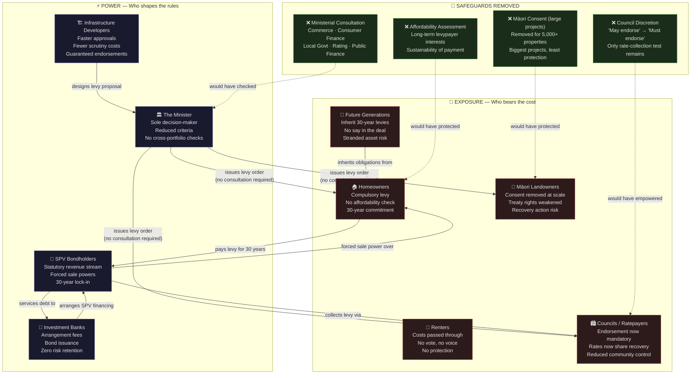
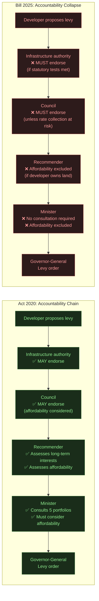
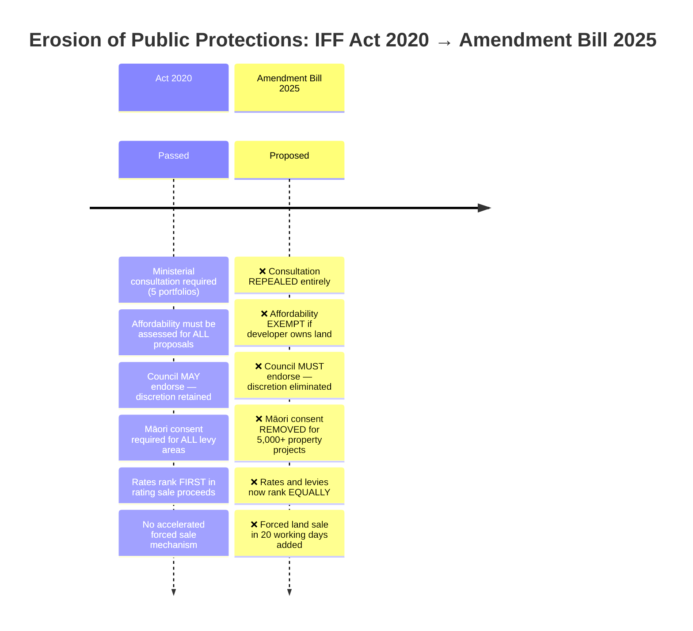
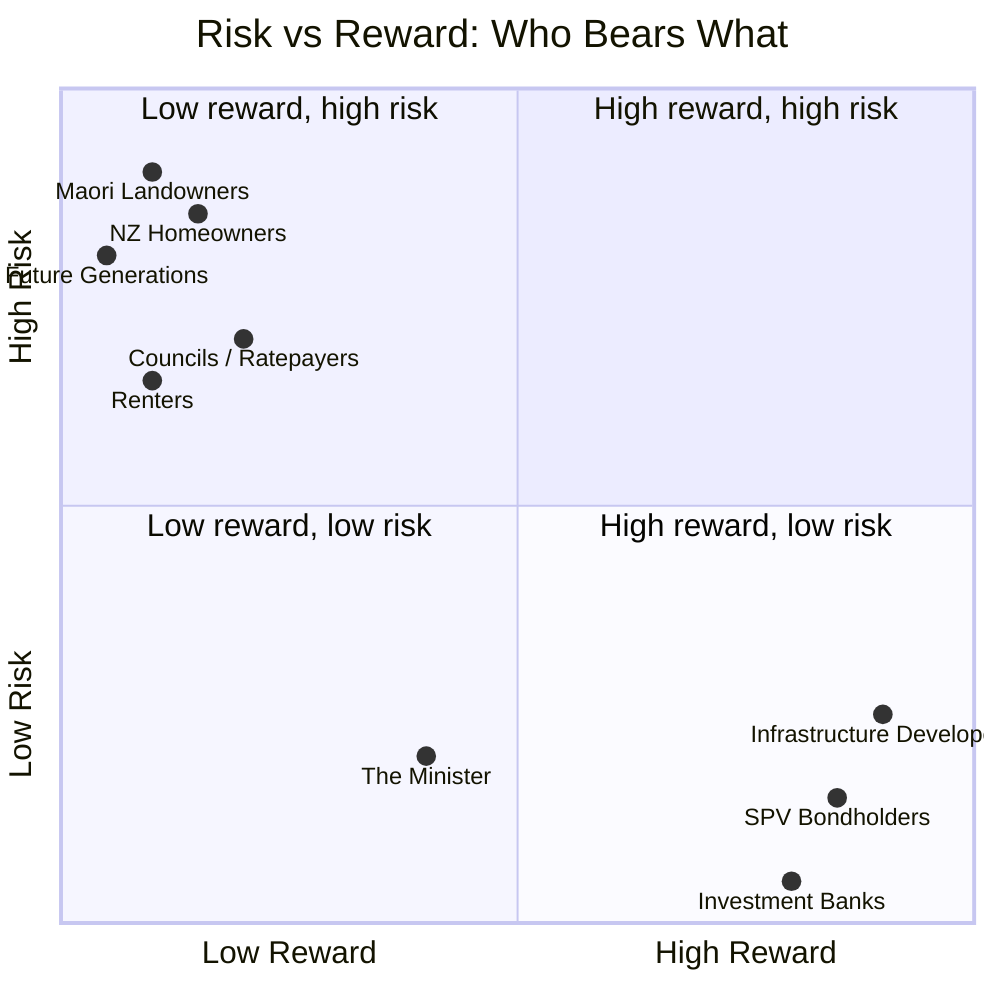

# Social and Economic Forces: IFF Amendment Bill 2025

## The Core Tension in One Sentence

> **The Bill transfers decision-making power from democratic institutions to private capital, while transferring financial risk from private capital to the public.**

---

## Force Map: Who Pushes, Who Gets Pushed



---

## The Accountability Gap



---

## Who Pays, Who Benefits: The Money Flow

```mermaid
sankey-beta
    "NZ Households" , "SPV Levy Revenue" , 45
    "NZ Businesses" , "SPV Levy Revenue" , 35
    "Industrial Users" , "SPV Levy Revenue" , 20
    "SPV Levy Revenue" , "Bond Debt Service" , 70
    "SPV Levy Revenue" , "Admin / Costs" , 10
    "SPV Levy Revenue" , "Infrastructure Construction" , 20
    "Bond Debt Service" , "International Bondholders" , 50
    "Bond Debt Service" , "NZ Institutional Investors" , 20
    "Infrastructure Construction" , "Developer / Construction Co." , 20
```

---

## Safeguards: What Was There, What Was Removed



---

## The Risk Transfer Diagram



---

## The 30-Year Lock-In: What Citizens Can't Do

| Situation | Can a citizen... | Answer |
|-----------|-----------------|--------|
| A levy is proposed for their area | ...participate in consultation? | ❌ Consultation repealed |
| The levy is unaffordable | ...require an affordability assessment? | ❌ Exempt if developer owns land |
| The council opposes the levy | ...rely on council to block it? | ❌ Council must endorse |
| Protected Māori land is included | ...require consent for large projects? | ❌ Removed at 5,000+ properties |
| The infrastructure becomes a stranded asset | ...stop paying the levy? | ❌ No early termination mechanism |
| The levy is excessive | ...get a refund mid-period? | ❌ Only at end of 30-year period |
| The SPV fails | ...end the levy? | ❌ A receiver continues it |
| The Minister makes a bad decision | ...trigger a review? | ❌ No review mechanism |
| They can't pay | ...avoid forced sale of their land? | ❌ After 4 months: yes, via SPV |

---

## The Democratic Deficit: One Infographic

```
BEFORE (Act 2020)                    AFTER (Bill 2025)

   PUBLIC INPUT                         PUBLIC INPUT
   ────────────                         ────────────
   ✅ 5 Ministers consulted              ❌ None required
   ✅ Affordability assessed             ❌ Waived for developer land
   ✅ Council can say no                 ❌ Council must say yes
   ✅ Māori consent required             ❌ Bypassed at scale
   ✅ Recommender analyses risks         ❌ Reduced criteria
   ✅ Report fully published             ❌ OIA redactions allowed

         │                                     │
         ▼                                     ▼

   DECISION QUALITY                    DECISION QUALITY
   ────────────────                    ────────────────
   6 independent checks                1 Minister
   Full criteria required              Reduced criteria
   Public information                  Commercially redacted

         │                                     │
         ▼                                     ▼

   WHO BEARS RISK                      WHO BEARS RISK
   ──────────────                      ──────────────
   Developer: shared                   Developer: minimal
   SPV: market risk                    SPV: statutory guarantee
   Levypayers: protected               Levypayers: unprotected
   Māori: consent right                Māori: consent removed
   Council: rate priority              Council: rate parity only
```

---

## Key Messages for Public Audiences

### For homeowners
> *"You could be levied for 30 years for infrastructure you were never asked about, assessed for affordability, or given any say in — and there's no way out."*

### For renters
> *"Your landlord pays the levy. Your rent goes up. You had no voice in the decision."*

### For Māori communities
> *"The bigger the project, the less your consent matters. The 5,000-property threshold means the largest developments — with the greatest impact — require no iwi consent."*

### For voters / citizens
> *"One Minister, with fewer checks than ever, can commit your community to 30 years of compulsory charges — on infrastructure that could be a stranded asset by the time it's half paid off."*

### For the energy/climate context
> *"A mechanism designed for suburban stormwater drains could — with modest amendments — fund a 30-year fossil fuel lock-in, with every household paying via their electricity bill, and no way to stop it when renewables make it redundant."*

---

*Supporting documents: IFFA-public-vs-corporate-interest-analysis.md · IFFA-forced-land-sale-mechanism.md · IFFA-LNG-terminal-energy-levy-scenario.md · IFFA-stranded-asset-scenario.md*
